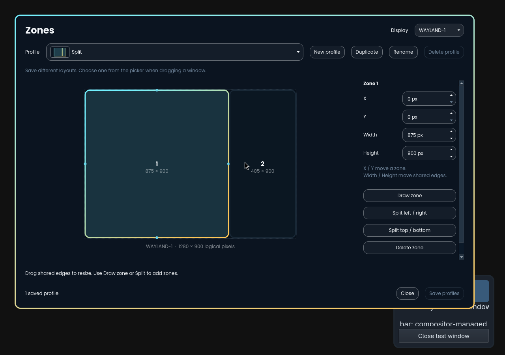

# Omarchy Zones

Dedicated window zones for large displays on Omarchy, inspired by Windows
PowerToys FancyZones. Define a layout once, then place a window exactly where
you want it with a hotkey and a drag.

**Plugin ID: `omarchy-zones` · Version: 0.3.1 · Status: proof of concept**



The screenshot uses a two-zone test layout in a private native Wayland display.

## Use it

1. Press **Super+Shift+F8** or launch **Omarchy Zones**. Draw, split, move, and
   resize zones with the mouse or exact numeric values. Shared boundaries grow
   one zone while shrinking its neighbor. Overlaps are rejected.
2. Save multiple named profiles. Reopening settings focuses the existing editor
   and preserves unsaved edits, including an open dialog.
3. Hold **Super+Shift before dragging** a window with the left mouse button.
   A profile picker appears at the top of the display.
4. Hover a miniature zone to preview its target, then release there to snap.
   You can also continue onto the full-size overlay and release over a zone.

The picker appears only during an activated window move. Ordinary Super+drag
stays native. Release Shift before dropping to cancel. On the tested Hyprland
build, changing modifiers can end a drag, so hold Shift before starting. Shift
plus an application's native title-bar drag also works.

Snapping is a **one-time operation**. Editing or changing profiles never
rearranges existing windows. Only zone definitions are saved; no window IDs,
assignments, or links. Snapped windows float and retain Hyprland's normal
floating-over-tiled stacking. There is no automatic placement, focus policy,
stacking policy, or terminal-specific behavior. Exposé remains independent.

## Compatibility

Tested on **Omarchy 4.0.4-1**, its **Lua-based Hyprland 0.56.2**, and **Qt 6.11.2**.
The native plugin must be built against headers matching the **running
Hyprland commit**, not merely the same version number. Rebuild after compositor
upgrades. Older `.conf`-based Omarchy releases are not supported by the installer.

Required: GCC with C++23 support, CMake, pkg-config, Qt 6 Base and Wayland,
tomlplusplus, Python 3, and matching Hyprland headers. On a compatible Omarchy
installation, missing build/runtime packages can be installed explicitly:

```sh
omarchy pkg add base-devel cmake pkgconf qt6-base qt6-wayland tomlplusplus
```

Do not replace or force-load mismatched Hyprland headers to bypass the ABI check.
Multiple physical monitors, rotation, fractional scaling, and XWayland still
need native validation. See [validation and limits](docs/validation.md).

## Install

Omarchy's official Git installer installs the **shell launcher**. It does not
compile or install native dependencies, so native setup is a separate explicit
step. No build or installation runs when the shell plugin is enabled.

```sh
omarchy plugin add https://github.com/shivam-g10/omarchy-zones.git
cd "$HOME/.config/omarchy/plugins/omarchy-zones"
./scripts/setup.sh install
omarchy plugin enable omarchy-zones
```

Review the checkout before enabling it. If the add command asks about enabling
immediately, leave it disabled until native setup finishes.

The native installer adds a marked block to `~/.config/hypr/hyprland.lua`, the
two hotkeys, an editor window rule, an application entry, and per-user binaries
under `~/.local/share/omarchy-zones/`. It refuses shortcut conflicts and preserves
unrelated desktop configuration. `XDG_CONFIG_HOME` and `XDG_DATA_HOME` are honored
by the native component; Omarchy's own Git installer uses its standard home path.

Build output goes to `${XDG_CACHE_HOME:-$HOME/.cache}/omarchy-zones/build`, outside
Omarchy's watched plugin checkout. Set `OMARCHY_ZONES_BUILD_DIR` to use a different
build directory. Setup never installs system packages or requests elevation.

The shell route opens the same native editor:

```sh
omarchy-shell shell summon omarchy-zones '{}'
```

The launcher unloads after handoff. Hiding or disabling it does not close an
editor with pending changes, and it does not disable the native snapping backend.
The hotkey and application entry also work without the shell launcher.

## Update or remove

Close the editor before a native update. Update the Git checkout, then rebuild
the native binaries against the running compositor:

```sh
omarchy plugin update omarchy-zones
cd "$HOME/.config/omarchy/plugins/omarchy-zones"
./scripts/setup.sh update
```

Native updates verify file ownership and ABI compatibility. They replace only
the two binaries and ownership manifest, with rollback for handled failures.
Saved profiles and desktop integration remain intact. Power-loss recovery during
an update is not a crash-durable transaction.

Remove the native component **before** deleting the shell checkout:

```sh
cd "$HOME/.config/omarchy/plugins/omarchy-zones"
./scripts/setup.sh remove
omarchy plugin remove omarchy-zones
```

This unloads the backend and removes owned integration, binaries, and shortcuts.
Edited owned files cause removal to stop instead of overwriting changes. Zone
definitions remain at `~/.config/omarchy-zones/zones.conf`. Existing window
positions are not restored. The compiler cache can be removed separately.

Existing standalone installations can use `./scripts/setup.sh update` from
their current checkout; reinstalling or replacing profiles is unnecessary.

## Design and development

- A C++ Hyprland plugin observes native drag/input/render events and performs
  one qualified move/resize after release. No idle polling or resident helper.
- A Qt Widgets editor runs only while open. A private socket forwards explicit
  relaunches, while a kernel lock prevents concurrent editors for one configuration.
- Shared theme parsing follows Omarchy colors, control states, font alias, and
  live Hyprland border gradients, width, and rounding.
- The small QML entry point follows Omarchy's official shell manifest/lifecycle.
  It opens the native editor and releases its loader without a resident service.

`hyprctl zones` reports overlay state, snap count, theme, and configuration errors
on demand. Definitions use monitor connector names and logical client pixels;
compositor borders extend outside the saved rectangle. Up to 12 profiles and
64 zones per profile are supported. Legacy v1 definitions are preserved and
converted only when saved. Grouped windows and conflicting application size
constraints are rejected.

See [CONTRIBUTING.md](CONTRIBUTING.md) for builds and checks,
[maintenance](docs/maintenance.md) for the code map, and
[Omarchy integration notes](docs/omarchy-integration.md) for the researched
packaging contract. Historical Rust feasibility work remains under
[`poc/rust-evaluation/`](poc/rust-evaluation/); it is not installed by the product.

Distribution is through this Git repository. No marketplace submission has been
made. The [official development](https://plugins.omarchy.org/develop.html) and
[publishing](https://plugins.omarchy.org/publish.html) guides informed this layout.

## License

A project license has not been selected yet. Public availability does not grant
a general reuse license. Licensing must be resolved before marketplace submission.
