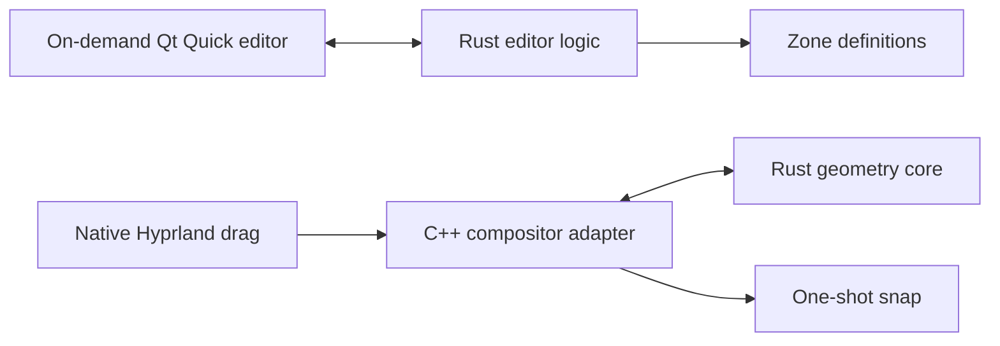

# Rust feasibility evaluation

Built and tested on 20 September 2026 with Hyprland 0.56.2, Qt 6.11.2,
Rust/Cargo 1.98.0, and GCC 16.2.0. This is an isolated experiment alongside the
installed C++ product, not a migration or replacement.

## Answer

Rust is viable for the editor and zone geometry. Both the official Qt Bridges
0.2.0 and KDAB CXX-Qt 0.10.0 built and ran as native Wayland editors. A Rust
geometry core also snapped actual native windows through a C++ Hyprland adapter.
The remaining difficulty is the compositor interface and product migration,
not whether Rust can create this UI.



The diagram is the proposed product architecture. In these experiments the
editor writes a test file, while the native plugin uses a fixed two-zone split.
They are deliberately separate feasibility slices; loading the editor's saved
file into the plugin is not implemented.

| Question | Evidence-backed answer |
| --- | --- |
| Can Rust provide the editor? | Yes. Two native editors passed mouse and numeric editing, shared-boundary constraints, save, and live theme update checks. Neither has handwritten C++. Both build generated C++ and use the Qt runtime. |
| Can the compositor plugin use Rust? | Yes, through the tested C++ adapter. Real drags invoke Rust hit testing and return the rectangle used by Hyprland. This does not prove a pure-Rust compositor plugin. |
| Will Rust make Omarchy theming harder? | No language-specific blocker was found. The QML UI reads the active palette, border gradient, border size, rounding, and shell font size. Full control styling still needs work. |
| Does building require a separate CMake project? | No. Cargo builds either editor. The native experiment uses Cargo plus one final C++ shared-library link, wrapped in a single script. Both toolchains and Qt/Hyprland development dependencies remain necessary for source builds. |
| Is installation easier? | It can be a small binary install, but Rust does not remove Qt runtime dependencies or Hyprland ABI compatibility. Staging and removal of the actual built artifacts passed. Public packages and upgrades were not implemented. |
| Is Rust lighter? | Not established. The measured native integration is small; either open Qt Quick editor uses tens of MiB PSS. No resident editor or helper is needed. Language alone does not determine the runtime cost. See the resource report. |

My recommendation is to use Rust plus QML for an editor migration and retain an
explicit C++ boundary for Hyprland. For this small standalone application, the
official Qt Bridges API was simpler to express; CXX-Qt is also a working option.
Choosing Qt Bridges means accepting its current public-beta status. A full
rewrite is not needed merely to fix the existing C++ editor's theme colors.
The resource results do not demonstrate a performance reason to migrate.

## Current Qt and Hyprland support

Qt announced its [official Rust bridge public beta on 1 July 2026](https://www.qt.io/blog/qt-bridges-public-beta-for-rust).
Its supported approach is Rust application objects with a Qt Quick/QML UI.
The pinned `qtbridge` 0.2.0 package declares Rust 1.87 or newer and Qt 6.10 or
newer; the [current development repository](https://github.com/qt/qtbridge-rust)
documents Rust 1.88 or newer. These are different revisions, not interchangeable
requirements. This host satisfies both.

[CXX-Qt 0.10](https://github.com/KDAB/cxx-qt/blob/v0.10.0/README.md) supports Rust
QObjects and QML through a [Cargo-driven build](https://kdab.github.io/cxx-qt/book/getting-started/4-cargo-executable.html).
Its Widgets support is limited: Rust objects can back existing C++ widgets; it
does not supply a complete Rust API for every QWidget. The installed editor is
Qt Widgets, so either QML experiment represents a UI port, not a syntax change.

The installed Hyprland plugin headers expose C++ objects, smart pointers, events,
and rendering types. [hyprland-rs](https://github.com/hyprland-community/hyprland-rs)
is useful for IPC; its plugin API loads or unloads native plugins, rather than
providing the native drag/render callbacks needed here. The tested adapter keeps
those responsibilities in C++. Plain rectangles and decisions cross into Rust;
no owning C++ pointers or window identities do. Rust panic containment and C++
callback guards are included, but this is not a claim that foreign code or the
compositor becomes memory-safe.

The native experiment still has approximately 240 lines of C++ adapter code and
a 14-line C ABI header. Rust supplies approximately 151 core lines and 146 test
lines. This is a real integration boundary, not a negligible or eliminated one.
See [native implementation notes](native/README.md).

## Native validation

Tests ran in a separate real Hyprland instance using its Wayland backend, at
1280 × 900 and scale 1. It was placed on a silent workspace. Every automated
pointer and keyboard event used a virtual seat connected only to its private
`/tmp/ozr-*` Wayland socket. The helper refuses the normal user runtime path.
There was no synthetic input into the user's desktop and no test plugin loaded
into the user's compositor.

The plugin passed these real-window checks:

- Holding the modifier without dragging leaves the overlay hidden.
- Super+Shift drag highlights and snaps to the right half, exactly 640,0,640,900.
- Shift plus an actual title-bar move snaps to the left half, exactly 0,0,640,900.
- Ordinary Super drag does not show zones or change the window's size.
- Releasing Shift before dropping cancels the snap.
- Unload/reload works. Drop completion clears the target reference and pending
  operation; a second window stays unchanged.

Each Qt editor passed actual numeric input (1280 to 1536), mouse movement of the
shared boundary (1536 to 1847), and a saved contiguous 1847/713 split. A separate
native sentinel window retained its position and size throughout editing and
saving. Changing a private copy of the active theme updated the visible QML
accent through filesystem events. The user's real theme was never edited.

The screenshots show the active cyan/gold border gradient, 3-pixel border,
12-pixel rounding, and theme palette. Generic Qt Quick controls remain visible;
this is not complete Omarchy control-style parity. The native plugin overlay
uses a fixed diagnostic color and has not been themed by this experiment.

The [resource report](resources.md) records the measured costs and limitations.
Reproduction generates screenshots and native-check JSON under `artifacts/`,
including `qtbridge-native.png`, `cxxqt-native.png`, `rust-native-overlay.png`,
`native-check.json`, `qtbridge-native-check.json`, and `cxxqt-native-check.json`.
These machine-specific files and the original compact validation report under
`evidence/` are retained locally and are not included in the public repository.

After testing, all 165 baseline desktop configuration files matched, no new
files appeared in those configuration directories, and no process remained on
the experiment's private runtime sockets. The installed Zones plugin still
reported version 0.2.0 with four profiles and no error. Its binaries and saved
definitions were not replaced by these experiments.

One early CXX-Qt UI test clicked stale coordinates because Qt had not yet
acknowledged the compositor resize. The harness now waits for the QML-reported
900 × 620 layout before input. Both editors pass using the corrected harness.
This was a test synchronization failure, not an observed application crash.

## Build and reversible staging

From this directory:

```sh
sh build-all.sh
python tools/package.py install --prefix /tmp/zones-rust-stage
python tools/package.py remove --prefix /tmp/zones-rust-stage
```

The build downloads pinned Cargo dependencies on the first run. The installed
host toolchains and development libraries were sufficient; no system package
was added. QML is embedded in each executable, but Qt shared libraries and QML
runtime modules remain external dependencies. CXX-Qt's build helper selected the
already-installed gold linker on this host and emitted a deprecation warning;
the build succeeded. See the individual [Qt Bridges](qtbridge/README.md) and
[CXX-Qt](cxxqt/README.md) notes for exact dependency and build observations.

Staging requires an explicit dedicated prefix. It writes three binaries and an
ownership/build-information manifest. It does not add bindings, desktop entries,
autoload, services, or configuration. Removal verifies ownership and preserves
unrelated files. Seven checks passed using the actual artifacts, including
repeat install, refusing modified/foreign files, and preserving a sentinel.
The original local `evidence/build-all.json` and `evidence/package-test.json`
record build and staging/removal results with artifact hashes.

First build attempts included dependency downloads, source corrections, and
different cache states; they are not a fair cold-build speed comparison. The
recorded final build-all timings are warm incremental builds. Native ABI hash
checking remains mandatory, and incompatible Hyprland updates require a rebuild.

## Reproduce the isolated checks

Requirements also include Python 3, `grim`, `wayland-scanner`, Wayland and
xkbcommon development files, and the existing repository's
`build/tests/native-window` test client. Build that client with
`bash ../../tests/build-native-tools.sh` from this directory if absent. Test polling and virtual input exist only in the test
tools; the product experiments have no idle polling loop.

```sh
bash tools/build-input.sh
python tools/lab.py start
python tools/native_check.py
python tools/editor_check.py qtbridge --measure
python tools/editor_check.py cxxqt --measure
python tools/native_measure.py
python tools/lab.py stop
```

Run the native checks sequentially; they share the private compositor. Close the
lab with the final command even if a test fails. `lab.py stop` only targets its
recorded compositor after checking its command line. Do not load the experiment
into the everyday session. `lab/`, build targets, generated input files, and raw
screenshots/samples under `artifacts/`, machine-specific reports and logs under
`evidence/`, and generated `.qmlls.ini` files are ignored by Git. The source,
reproduction tools, and readable research notes are included in the repository.

## Remaining limits

This is a feasibility PoC, not full profile/editor parity. The editor and native
geometry are not a single shared crate yet. The native slice has two fixed
zones and no profile selector or persistence. Arbitrary zones, constraints on
complex shared edges, and profile migration have not been ported.

Native tests used one nested Wayland monitor, not the physical desktop's complete
display setup. Multi-monitor movement, fractional scaling, rotation, XWayland,
high-DPI input, sustained use, and accessibility are unvalidated. GPU memory and
peak RAM are not measured. The theme test changed a private file; a complete
Omarchy theme switch and all arbitrary live Hyprland option changes were not
tested. Refresh theme queries live options on demand. The current gradient
adapter uses the first and last colors and the angle; it discards alpha and
intermediate stops. Shell control-opacity tokens are read but are not yet
applied to the generic controls.
